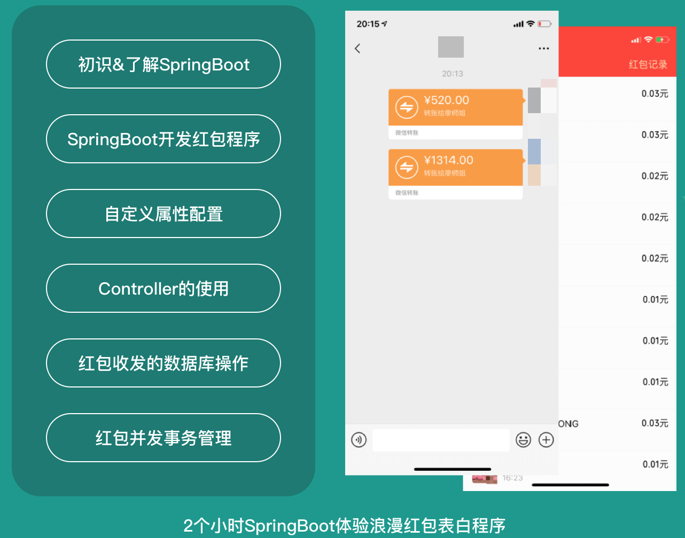

[TOC]

## 简介

SpringBoot两小时快速入门，极客表白浪漫红包

信息时代最重视的是什么？是效率！企业最重视的人才是什么？是高效能人士！所谓“天下武功唯快不破 ” ，为此专门推出此教程，让你快速Get到SpringBoot实际应用技能。本教程所有代码、笔记由bennyrhys免费提供，遵循”学习其实可以很快乐“的原则，以极客浪漫情怀的”红包表白程序“为场景，贯穿微服务必学框架-SpringBoot相关内容，将初学SpringBoot的踩坑点进行指点，为同学打造麻雀虽小五脏俱全的教程。标题风趣幽默，必然让你本次的学习之旅尽兴而归。载着干货的老司机，在召唤你~

## 相关链接

GitHub:[点击预览——极客浪漫红包表白程序](https://github.com/bennyrhys/LuckyMoney-SpringBootProject)

详细文档：[点击搜索——极客浪漫红包表白详解](https://bennyrhys.github.io/about/)

## 目录

- 【让宝宝不要输在起跑线】
  - 文档说明
  - 版本配置
- 【初识】SpringBoot-hello world
  - 解决打包失败
  - 配置文件
    - application.properties
    - application.yml(推荐)
  - git提交 ：helloworld+yml启动及简单配置
- 【君子之交-淡如水】解放双手，配置红包
  - 手动单个配置
  - 自动多个配置红包金额【limit类限制金额范围】
- 生成环境开发环境划分

- 小结
- 【人生若只如初见】从“程序”入口Controller开始
  - controller+thymeleaf（不推荐，前后端不分离）
  - 恢复访问@Controller+@ResponseBody
  - 多访问url同返回（名称数组）
  - url深层访问：@RequestMapping("hello")
  - post请求访问
  - Get/post都行的访问
  - 获取请求携带的参数
  - git提交
- 【收获人生"红颜”知己】撸程序-红包收发操作数据库
  - 搭配方案：
  - restful-api设计
  - 引入pom jpa+mysql
  - yml配置mysql
  - 数据库-创建
  - LuckymoneyRepository接口
  - LuckmoneyController
  - 列表输出
- 【搞定并发就在一起】事务就像乱点鸳鸯的丈母娘
  - LuckymoneyService
  - LuckmoneyController	
  - 请求发送红包
  - 配置测试环境
  - 搞定并发