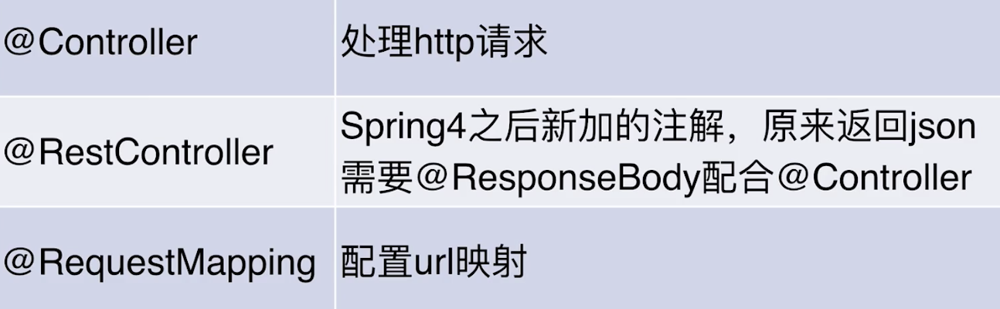

[TOC]

# 【让宝宝不要输在起跑线】文档说明

作者：bennyrhys@163.com

## 版本配置

Jdk1.8.111

meaven3.5.4

springboot2.1.3

# 【初识】SpringBoot-hello world

```java
package com.bennyrhys.luckymoney;

import org.springframework.web.bind.annotation.GetMapping;
import org.springframework.web.bind.annotation.RequestMapping;
import org.springframework.web.bind.annotation.RequestMethod;
import org.springframework.web.bind.annotation.RestController;

@RestController
public class HelloController {
//    @GetMapping("/hello")
    @RequestMapping(value = "/hello", method = RequestMethod.GET)
    public  String hello(){
        return "hello world";
    }
}
```

命令行启动

```luckymoney bennyrhys$ mvn spring-boot:run```

终止

ctrl+c

## 解决打包失败

```xml
<!--            为了打包后加的-->
            <plugin>
                <groupId>org.apache.maven.plugins</groupId>
                <artifactId>maven-surefire-plugin</artifactId>
                <configuration>
                    <skipTests>true</skipTests>
                </configuration>
            </plugin>
```

查看jar包

ls target/

运行jar

java -jar target/luckymoney-0.0.1-SNAPSHOT.jar

访问：http://localhost:8080/hello

## 配置文件

###  application.properties

```xml
server.servlet.context-path=/luckymoney
server.port=8081
```

### application.yml(推荐)

```yml
server:
  port: 8081
  servlet:
    context-path: /luckymoney
```

访问：http://localhost:8081/luckymoney/hello

## git提交 ：helloworld+yml启动及简单配置

```
//初始化
springboot2小时浪漫红包 bennyrhys$ git init
//配置提交用户
git config user.name bennyrhys
git config user.email bennyrhys@163.com
//验证用户信息
cat .git/config
[core]
	repositoryformatversion = 0
	filemode = true
	bare = false
	logallrefupdates = true
	ignorecase = true
	precomposeunicode = true
[user]
	name = bennyrhys
	email = bennyrhys@163.com
//查看文件状态
git status
On branch master

No commits yet

Untracked files:
  (use "git add <file>..." to include in what will be committed)

	.DS_Store
	luckymoney/
//添加修改文件到暂存区
git add luckymoney/
//添加文件到数据库
git commit -m "hello world+yml 简单配置启动"
//建立远程连接
//列出已经存在的远程分支 -v详情
git remote -v
//创建远程分支
git remote add  origin_lm https://github.com/bennyrhys/LuckyMoney.git 
//检测分支
git remote -v
origin_lm	https://github.com/bennyrhys/LuckyMoney.git (fetch)
origin_lm	https://github.com/bennyrhys/LuckyMoney.git (push)
//此处切记更改上传人密钥信息
//push文件
git push origin_lm master
//远程仓库名冲突，修改远程分支
git remote remove origin_lm
//新建远程分支
git remote add origin_lm  https://github.com/bennyrhys/LuckyMoney-SpringBootProject.git
//因为github原有README.md文档需要解决冲突
git pull origin_lm master
//git push origin_lm master
```

# 【君子之交-淡如水】解放双手，配置红包

## 手动单个配置

1 .application.yml

```properties
mixMoney: 1
maxMoney: 99
description: 最少要发${mixMoney}元
```

2 .HelloController

```java
@RestController
public class HelloController {
//法1：手动引入配置信息
    @Value("${mixMoney}")
    private BigDecimal mixMoney;
    @Value("${description}")
    private String description;


    @GetMapping("/hello")
//    @RequestMapping(value = "/hello", method = RequestMethod.GET)
    public  String hello(){
        return "mixMoney"+mixMoney+"说明"+description;
    }
}
```

3. 访问http://localhost:8081/luckymoney/hello
4. 输出：mixMoney1说明最少要发1元
5. Git上传到分支confmoney

```
bennyrhysdeMacBook-Pro:LuckyMoney-SpringBootProject bennyrhys$ git branch
* master
bennyrhysdeMacBook-Pro:LuckyMoney-SpringBootProject bennyrhys$ git checkout -b confmoney
M	luckymoney/src/main/java/com/bennyrhys/luckymoney/HelloController.java
M	luckymoney/src/main/resources/application.yml
M	luckymoney_note.md
Switched to a new branch 'confmoney'
bennyrhysdeMacBook-Pro:LuckyMoney-SpringBootProject bennyrhys$ git branch
* confmoney
  master
bennyrhysdeMacBook-Pro:LuckyMoney-SpringBootProject bennyrhys$ git status
On branch confmoney
Changes not staged for commit:
  (use "git add <file>..." to update what will be committed)
  (use "git checkout -- <file>..." to discard changes in working directory)

	modified:   luckymoney/src/main/java/com/bennyrhys/luckymoney/HelloController.java
	modified:   luckymoney/src/main/resources/application.yml
	modified:   luckymoney_note.md

Untracked files:
  (use "git add <file>..." to include in what will be committed)

	.DS_Store
	luckymoney/.DS_Store

no changes added to commit (use "git add" and/or "git commit -a")
bennyrhysdeMacBook-Pro:LuckyMoney-SpringBootProject bennyrhys$ git add .
bennyrhysdeMacBook-Pro:LuckyMoney-SpringBootProject bennyrhys$ git commit -m "红包金额-手动配置"
[confmoney bde8c36] 红包金额-手动配置
 5 files changed, 59 insertions(+), 5 deletions(-)
 create mode 100644 .DS_Store
 create mode 100644 luckymoney/.DS_Store
bennyrhysdeMacBook-Pro:LuckyMoney-SpringBootProject bennyrhys$ git remote -v
origin	https://github.com/bennyrhys/LuckyMoney-SpringBootProject.git (fetch)
origin	https://github.com/bennyrhys/LuckyMoney-SpringBootProject.git (push)
origin_lm	https://github.com/bennyrhys/LuckyMoney-SpringBootProject.git (fetch)
origin_lm	https://github.com/bennyrhys/LuckyMoney-SpringBootProject.git (push)
bennyrhysdeMacBook-Pro:LuckyMoney-SpringBootProject bennyrhys$ git push origin_lm confmoney
Enumerating objects: 27, done.
Counting objects: 100% (27/27), done.
Delta compression using up to 4 threads
Compressing objects: 100% (11/11), done.
Writing objects: 100% (15/15), 2.37 KiB | 2.37 MiB/s, done.
Total 15 (delta 3), reused 0 (delta 0)
remote: Resolving deltas: 100% (3/3), completed with 2 local objects.
remote: 
remote: Create a pull request for 'confmoney' on GitHub by visiting:
remote:      https://github.com/bennyrhys/LuckyMoney-SpringBootProject/pull/new/confmoney
remote: 
To https://github.com/bennyrhys/LuckyMoney-SpringBootProject.git
 * [new branch]      confmoney -> confmoney
```

## 自动多个配置红包金额【limit类限制金额范围】

1. application.yml

```properties
limit:
  minMoney: 1
  maxMoney: 99
  description: 最少要发${limit.minMoney}元,最多发${limit.maxMoney}元
```

2. LimitConfig

```java
package com.bennyrhys.luckymoney;

import org.springframework.beans.factory.annotation.Autowired;
import org.springframework.beans.factory.annotation.Value;
import org.springframework.web.bind.annotation.GetMapping;
import org.springframework.web.bind.annotation.RequestMapping;
import org.springframework.web.bind.annotation.RequestMethod;
import org.springframework.web.bind.annotation.RestController;

import java.math.BigDecimal;

@RestController
public class HelloController {

//法2；自动注入
    @Autowired
    LimitConfig limitConfig;


    @GetMapping("/hello")
    public  String hello(){
        return "说明"+limitConfig.getDescription();
    }
}
```

3. HelloController

```java
package com.bennyrhys.luckymoney;

import org.springframework.beans.factory.annotation.Autowired;
import org.springframework.beans.factory.annotation.Value;
import org.springframework.web.bind.annotation.GetMapping;
import org.springframework.web.bind.annotation.RequestMapping;
import org.springframework.web.bind.annotation.RequestMethod;
import org.springframework.web.bind.annotation.RestController;

import java.math.BigDecimal;

@RestController
public class HelloController {

//法2；自动注入
    @Autowired
    LimitConfig limitConfig;


    @GetMapping("/hello")
    public  String hello(){
        return "说明"+limitConfig.getDescription();
    }
}
```

4. 输出

http://localhost:8081/luckymoney/hello

说明最少要发1元,最多发99元

5. git提交

```
bennyrhysdeMacBook-Pro:LuckyMoney-SpringBootProject bennyrhys$ git branch
* confmoney
  master
bennyrhysdeMacBook-Pro:LuckyMoney-SpringBootProject bennyrhys$ git status
On branch confmoney
Changes to be committed:
  (use "git reset HEAD <file>..." to unstage)

	new file:   luckymoney/src/main/java/com/bennyrhys/luckymoney/LimitConfig.java

Changes not staged for commit:
  (use "git add <file>..." to update what will be committed)
  (use "git checkout -- <file>..." to discard changes in working directory)

	modified:   README.md
	modified:   luckymoney/src/main/java/com/bennyrhys/luckymoney/HelloController.java
	modified:   luckymoney/src/main/java/com/bennyrhys/luckymoney/LimitConfig.java
	modified:   luckymoney/src/main/resources/application.yml
	modified:   luckymoney_note.md

Untracked files:
  (use "git add <file>..." to include in what will be committed)

	README.assets/

bennyrhysdeMacBook-Pro:LuckyMoney-SpringBootProject bennyrhys$ git add .
bennyrhysdeMacBook-Pro:LuckyMoney-SpringBootProject bennyrhys$ git commit -m "limit类限制金额自动配置"
```

# 生成环境开发环境划分

1. 思路

> dev开发模式
>
> prod生产模式
>
> 由yml控制选择模式
>
> 
>
> 场景
>
> dev：测试0.1 元
>
> prod：正式1元


2.  application-dev.yml

```properties
spring:
  profiles:
    active: dev #设定部署的测试配置开发、生产(如果正式上线，可以不修改此处，打包后命令切换环境)
```

3. application-dev.yml

```properties
server:
  port: 8081
  servlet:
    context-path: /luckymoney
limit:
  minMoney: 0.1
  maxMoney: 99
  description: 最少要发${limit.minMoney}元,最多发${limit.maxMoney}元
```

4. application-prod.yml

```properties
server:
  port: 8081
  servlet:
    context-path: /luckymoney
limit:
  minMoney: 1
  maxMoney: 99
  description: 最少要发${limit.minMoney}元,最多发${limit.maxMoney}元
```

5. 输出

> Dev:说明最少要发0.1元,最多发99元
>
> Prod:说明最少要发1元,最多发99元

6. 打包命令切换开发环境

```
meaven使用
//项目根目录打包
mvn clean package
//普通启动-开发环境
java -jar target/luckymoney-0.0.1-SNAPSHOT.jar
//启动时修改-生产环境
java -jar -Dspring.profiles.active=prod  target/luckymoney-0.0.1-SNAPSHOT.jar
```


6. git上传

```
bennyrhysdeMacBook-Pro:LuckyMoney-SpringBootProject bennyrhys$ git branch
* confmoney
  master
bennyrhysdeMacBook-Pro:LuckyMoney-SpringBootProject bennyrhys$ git add .
bennyrhysdeMacBook-Pro:LuckyMoney-SpringBootProject bennyrhys$ git commit -m "多环境配置-生产、开发"
[confmoney b3f8623] 多环境配置-生产、开发
 4 files changed, 137 insertions(+), 10 deletions(-)
 create mode 100644 luckymoney/src/main/resources/application-dev.yml
 create mode 100644 luckymoney/src/main/resources/application-prod.yml
bennyrhysdeMacBook-Pro:LuckyMoney-SpringBootProject bennyrhys$ git push origin_lm confmoney

```


# 小结

@Value //单个配置

@Component 	@ConfigurationProperties//多个配置

多环境配置

# 【人生若只如初见】从“程序”入口Controller开始



@requestmapping旧版使用，新版@getmapping，但有个别场景还是会使用到它的

## controller+thymeleaf（不推荐，前后端不分离）

将restcontrller改成contrllre（报错），增添thymeleaf模版，返回指定templates-index页面

1. 改成旧版controller

```java
package com.bennyrhys.luckymoney;

import org.springframework.beans.factory.annotation.Autowired;
import org.springframework.beans.factory.annotation.Value;
import org.springframework.stereotype.Controller;
import org.springframework.web.bind.annotation.GetMapping;
import org.springframework.web.bind.annotation.RequestMapping;
import org.springframework.web.bind.annotation.RequestMethod;
import org.springframework.web.bind.annotation.RestController;

import java.math.BigDecimal;

@Controller
public class HelloController {

//法2；自动注入
    @Autowired
    LimitConfig limitConfig;


    @GetMapping("/hello")
    public  String hello(){
//        return "说明"+limitConfig.getDescription();
        return "index";
    }
}
```

2. pom.xml,新增thymeleaf模版

```xml
<dependency>
    <groupId>org.springframework.boot</groupId>
    <artifactId>spring-boot-starter-thymeleaf</artifactId>
</dependency>
```

3. 新建thymeleaf模版index页面

4.访问

http://localhost:8081/luckymoney/hello

hello world

5. git上传

```
bennyrhysdeMacBook-Pro:LuckyMoney-SpringBootProject bennyrhys$ git add .
bennyrhysdeMacBook-Pro:LuckyMoney-SpringBootProject bennyrhys$ git commit -m "controller+thymeleaf"
[confmoney 0c07f43] controller+thymeleaf
 6 files changed, 94 insertions(+), 2 deletions(-)
 create mode 100644 luckymoney/src/main/resources/templates/index.html
 create mode 100644 luckymoney_note.assets/image-20191229164307062.png
 create mode 100644 luckymoney_note.assets/image-20191229164313530.png
bennyrhysdeMacBook-Pro:LuckyMoney-SpringBootProject bennyrhys$ git push origin_lm confmoney
```

## 恢复访问@Controller+@ResponseBody

注销thymeleaf，新增@RestponseBody恢复页面访问，消除报错

**@RestponseBody使用，当同时两个方法使用，@RestponseBody添加返回字符串，不加返回h5页面**

http://localhost:8081/luckymoney/hello

http://localhost:8081/luckymoney/hello2


1. pom.xml

```
  <!--      <dependency>
            <groupId>org.springframework.boot</groupId>
            <artifactId>spring-boot-starter-thymeleaf</artifactId>
        </dependency>
-->
//注销模版使用，记得每次修改meaven要重新import一下
//@Controller+@ResponseBody=@RestController
//@ResponseBody可以放在方法上用
```

2. HelloController//单独合并两个注解功能

```java
package com.bennyrhys.luckymoney;

import org.springframework.beans.factory.annotation.Autowired;
import org.springframework.beans.factory.annotation.Value;
import org.springframework.stereotype.Controller;
import org.springframework.web.bind.annotation.*;

import java.math.BigDecimal;

@Controller
//@ResponseBody
public class HelloController {

//法2；自动注入
    @Autowired
    LimitConfig limitConfig;

    @ResponseBody
    @GetMapping("/hello")
    public  String hello(){
        return "说明"+limitConfig.getDescription();
//        return "index";
    }
}
```

3. HelloController同时返回 字符串+thymeleaf h5

```java
package com.bennyrhys.luckymoney;

import org.springframework.beans.factory.annotation.Autowired;
import org.springframework.beans.factory.annotation.Value;
import org.springframework.stereotype.Controller;
import org.springframework.web.bind.annotation.*;

import java.math.BigDecimal;

@Controller
//@ResponseBody
public class HelloController {

//法2；自动注入
    @Autowired
    LimitConfig limitConfig;

    @ResponseBody
    @GetMapping("/hello")
    public  String hello(){
        return "说明"+limitConfig.getDescription();
//        return "index";
    }
    @GetMapping("/hello2")
    public  String hello2(){
        return "index";
    }
}
```

4. git上传

```
git commit -m "@controller+@ResponseBody"
git push origin_lm confmoney
```

## 多访问url同返回（名称数组）

快捷键：command+p//查看@GetMapping("/hello")，括号内参数类型

- http://localhost:8081/luckymoney/hi  == http://localhost:8081/luckymoney/hello 不同名访问同返回

```
@GetMapping({"/hello","/hi"})
```

## url深层访问：@RequestMapping("hello")

- http://localhost:8081/luckymoney/hello/say url深层访问

低级做法：不方便维护，每次写深路径

```java
@GetMapping("/hello/say")
```

高级做法：@RequestMapping("hello")

```java
package com.bennyrhys.luckymoney;

import org.springframework.beans.factory.annotation.Autowired;
import org.springframework.beans.factory.annotation.Value;
import org.springframework.stereotype.Controller;
import org.springframework.web.bind.annotation.*;

import java.math.BigDecimal;
@RequestMapping("hello")
@RestController
public class HelloController {

    @Autowired
    LimitConfig limitConfig;

    @GetMapping("/say")
    public  String hello(){
        return "说明"+limitConfig.getDescription();
    }

}
```

## post请求访问

​    @PostMapping("/say")

get无法接受请求，使用工具postman发送post请求

```java
package com.bennyrhys.luckymoney;

import org.springframework.beans.factory.annotation.Autowired;
import org.springframework.beans.factory.annotation.Value;
import org.springframework.stereotype.Controller;
import org.springframework.web.bind.annotation.*;

import java.math.BigDecimal;
@RequestMapping("hello")
@RestController
public class HelloController {

    @Autowired
    LimitConfig limitConfig;

//    @GetMapping("/say")
    @PostMapping("/say")
    public  String hello(){
        return "说明"+limitConfig.getDescription();
    }

}
```

## Get/post都行的访问

不推荐，请求要明确，都行刷流氓

```java
package com.bennyrhys.luckymoney;

import org.springframework.beans.factory.annotation.Autowired;
import org.springframework.beans.factory.annotation.Value;
import org.springframework.stereotype.Controller;
import org.springframework.web.bind.annotation.*;

import java.math.BigDecimal;
@RequestMapping("hello")
@RestController
public class HelloController {

    @Autowired
    LimitConfig limitConfig;

//    @GetMapping("/say")
//    @PostMapping("/say")
    @RequestMapping("/say")
    public  String hello(){
        return "说明"+limitConfig.getDescription();
    }

}
```

## 获取请求携带的参数


- url-简洁hello/say/100

@PathVariable("id") +@GetMapping("/say/{id}")

HelloController

```java
package com.bennyrhys.luckymoney;

import org.springframework.beans.factory.annotation.Autowired;
import org.springframework.beans.factory.annotation.Value;
import org.springframework.stereotype.Controller;
import org.springframework.web.bind.annotation.*;

import java.math.BigDecimal;
@RequestMapping("hello")
@RestController
public class HelloController {

    @Autowired
    LimitConfig limitConfig;

    @GetMapping("/say/{id}")
    public  String hello(@PathVariable("id") Integer id){
        return "id:"+id;
    }

}
```

http://localhost:8081/luckymoney/hello/say/100

id:100

- url-hello/say?id=19

@RequestParam("id"),撤销@GetMapping("/say")的{id}

注意：@RequestParam中id和访问say?id=19名称一致，访问的id不能为空

HelloController

```java
package com.bennyrhys.luckymoney;

import org.springframework.beans.factory.annotation.Autowired;
import org.springframework.beans.factory.annotation.Value;
import org.springframework.stereotype.Controller;
import org.springframework.web.bind.annotation.*;

import java.math.BigDecimal;
@RequestMapping("hello")
@RestController
public class HelloController {

    @Autowired
    LimitConfig limitConfig;

    @GetMapping("/say")
    public  String hello(@RequestParam("id") Integer id){
        return "id:"+id;
    }

}
```

http://localhost:8081/luckymoney/hello/say?id=19

id:19

- url-hello/say?id=为空时

设置属性非必须属性设置

```
public  String hello(@RequestParam(value = "id" , required = false, defaultValue = "0") Integer id){
```

不传id时默认为0

http://localhost:8081/luckymoney/hello/say

id:0

- 访问切换成post请求

请求方式多样，可以跟在url-hello/say?id=后面，也可以在请求体中

推荐参数 放在body的urlencode里面

```java
@PostMapping("/say")
```

## git提交

confmoney分支 commit “controller-end”

# 【收获人生"红颜”知己】撸程序-红包收发操作数据库

## 搭配方案：

java端：spring-data-jpa：持久层配置标准，定义标准好比接口，实现此规范的产品hibernate，toplink，对spring整合，不用写一行sql语句操作

数据库：mysql

## restful-api设计

| 请求类型 | 请求路径       | 请求功能       |
| -------- | -------------- | -------------- |
| get      | /luckmoneys    | 获取红包列表   |
| post     | /luckmoneys    | 创建一个红包   |
| get      | /luckmoneys/id | 通过id查询红包 |
| put      | /luckmoneys/id | 通过id更新红包 |

## 引入pom jpa+mysql

```
<dependency>
    <groupId>org.springframework.boot</groupId>
    <artifactId>spring-boot-starter-data-jpa</artifactId>
</dependency>
<dependency>
    <groupId>mysql</groupId>
    <artifactId>mysql-connector-java</artifactId>
</dependency>
```

注意：不要加版本号，Springbot已经选择好了版本

## yml配置mysql

先建立数据库luckmoney

```
server:
  port: 8081
  servlet:
    context-path: /luckymoney
limit:
  minMoney: 0.1
  maxMoney: 99
  description: 最少要发${limit.minMoney}元,最多发${limit.maxMoney}元
spring:
  datasource:
    driver-class-name: com.mysql.cj.jdbc.Driver
    url: jdbc:mysql://localhost:3306/luckmoney
    username: root
    password: rootroot
  jpa:
    hibernate:
      ddl-auto: create
    show-sql: true #控制台显示sql命令
```

## 数据库-创建表

不需要执行sql

创建java文件命名时首字母大写，**中间不要驼峰命名**，默认识别为一个单词

Luckmoney.java 【空构造方法、get/set、@id导包不要错Java.presistence、id自增】

```java
package com.bennyrhys.luckymoney;

import javax.persistence.Entity;
import javax.persistence.GeneratedValue;
import javax.persistence.Id;
import java.math.BigDecimal;
@Entity
public class Luckmoney {
    @Id
    @GeneratedValue //自增
    private Integer id;
    private BigDecimal money;
    private String producer;//发送方
    private String consumer;//接收方
```

运行，自动创建表

> 控制台输出sql
>
> Hibernate: drop table if exists hibernate_sequence
> Hibernate: drop table if exists luckmoney
> Hibernate: create table hibernate_sequence (next_val bigint) engine=MyISAM
> Hibernate: insert into hibernate_sequence values ( 1 )
> Hibernate: create table luckmoney (id integer not null, consumer varchar(255), money decimal(19,2), producer varchar(255), primary key (id)) engine=MyISAM

填充表中数据，并关闭创建表yml配置create->update

```
  jpa:
    hibernate:
      ddl-auto: update
    show-sql: true #控制台显示sql命令
```

## LuckymoneyRepository接口

Repository就是和数据连接的Dao，这样写和jpa命名一致

继承JpaRepository<Luckmoney,Integer>**数据库的实体类，和id的类型**

```
package com.bennyrhys.luckymoney;

import org.springframework.data.jpa.repository.JpaRepository;

public interface LuckymoneyRepository extends JpaRepository<Luckmoney,Integer> {
}
```

## LuckmoneyController

先写好dao接口再调cotroller

```java
package com.bennyrhys.luckymoney;

import java.util.List;

public class LuckmoneyController {
    /**
     * 获取红包列表
     */
    public List<Luckmoney> list(){

    }
}
```


 ## 列表输出

```
get：http://localhost:8081/luckymoney/luckymoneys
[{"id":1,"money":0.10,"producer":"李四","consumer":"zhangsan"},{"id":2,"money":0.20,"producer":"王五","consumer":"李四"}]

post：http://localhost:8081/luckymoney/luckymoneys
producer 啊本
money 10
{
    "id": 3,
    "money": 10,
    "producer": "啊本",
    "consumer": null
}

get：http://localhost:8081/luckymoney/luckymoneys/2
{
    "id": 2,
    "money": 100.00,
    "producer": "瑞新",
    "consumer": null
}

put：http://localhost:8081/luckymoney/luckymoneys/2
consumer 师姐
{
    "id": 2,
    "money": 1.00,
    "producer": "阿本",
    "consumer": "师姐"
}
```

# 【搞定并发就在一起】事务就像乱点鸳鸯的丈母娘

数据库事务，要么都完成要么都不做

## LuckymoneyService

```java
package com.bennyrhys.luckymoney;

import org.springframework.beans.factory.annotation.Autowired;
import org.springframework.stereotype.Service;

import java.math.BigDecimal;
@Service
public class LuckymoneyService {
    @Autowired
    private LuckymoneyRepository luckymoneyRepository;
    /**
     * 创建两个红包
     */
    public void createTwo(){
        Luckmoney luckmoney = new Luckmoney();
        luckmoney.setProducer("瑞新");
        luckmoney.setMoney(new BigDecimal("520"));

        luckymoneyRepository.save(luckmoney);
        Luckmoney luckmoney2 = new Luckmoney();
        luckmoney2.setProducer("瑞新");
        luckmoney2.setMoney(new BigDecimal("1314"));

        luckymoneyRepository.save(luckmoney2);
    }
}
```

## LuckmoneyController

```java
/**
 * 发两个红包-测试
 */
@PostMapping("luckymoneys/two")
public void creatTwo(){
    service.createTwo();
}
```

## 请求发送红包

http://localhost:8081/luckymoney/luckymoneys/two	状态码返回200

> Hibernate: select next_val as id_val from hibernate_sequence for update
> Hibernate: update hibernate_sequence set next_val= ? where next_val=?
> Hibernate: insert into luckmoney (consumer, money, producer, id) values (?, ?, ?, ?)
> Hibernate: select next_val as id_val from hibernate_sequence for update
> Hibernate: update hibernate_sequence set next_val= ? where next_val=?
> Hibernate: insert into luckmoney (consumer, money, producer, id) values (?, ?, ?, ?)

## 配置测试环境

decimal类型的金额，设置长度为五位（则整数为3小数为2）

1314的红包创建报错，数值越界Out of range value for column 'money' at row 1

写入一条520，另一条1314失败，不符合同时发生的事务要求


## 搞定并发

添加注解@Transactional,选择导入spring那个，先清空数据库，结果520依旧存入，1314失败

- 事务理解：
  - @注解控制java事务
  - 有些数据库不支持事务，mysql有自己的事务机制（MYISAM）->(mysql支持多类型修改成innoDB实现事务)

​	


